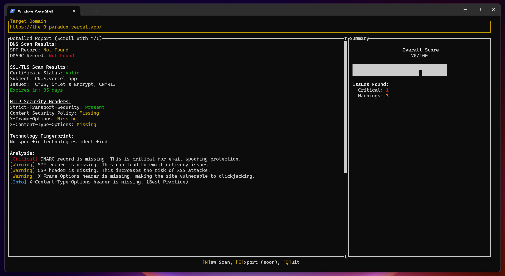

# Vanguard RS - the Scanner



*A hyper-performant, privacy-first security analysis toolkit forged in 100% Rust.*

[](https://opensource.org/licenses/MIT)
[](https://www.rust-lang.org/)
[]()

---

## The Mission

Vanguard RS aims to democratize cybersecurity. We believe that everyone, from students to seasoned professionals, should have access to high-quality tools to understand and improve their security posture without compromising on privacy. Vanguard RS is built on three pillars: **Local Power, Radical Transparency, and Total User Control.**

This is a tool built for the community, by the community. It performs all scans on your machine, ensuring that no sensitive data ever leaves your control.

## Key Features

- **Comprehensive Analysis**: Scans for DNS configuration (SPF, DMARC), SSL/TLS certificate validity, crucial HTTP security headers, and performs technology fingerprinting.
- **Interactive TUI Dashboard**: A clean, keyboard-driven Terminal User Interface built with the powerful `ratatui` library, providing an at-a-glance summary and a detailed, scrollable report.
- **Blazingly Fast**: Leverages Rust's fearless concurrency with `tokio` to run all scan modules in parallel. The total scan time is determined by the slowest check, not the sum of all checks.
- **100% Privacy-First**: No data is sent to third-party servers. Everything runs locally. Period.
- **Intelligent Input Parsing**: Paste a full URL, a domain with `www.`, or just the domain name—the parser will correctly extract the target.

## The Architectural Choice: Why 100% Rust?

This project began its life with a different stack (Tauri + SolidJS). While functional, it became clear that the project's core ethos—performance, security, and minimal overhead—wasn't fully realized. A webview-based application, by its very nature, carries the baggage of a browser engine and a JavaScript runtime.

We pivoted to a pure Rust architecture for several uncompromising reasons:

1.  **Zero-Overhead Philosophy**: By eliminating the webview and JS bridge, we removed an entire layer of abstraction and potential performance bottlenecks. The result is a tool with near-instantaneous startup time and minimal memory and CPU footprint. It's as close to the metal as it gets for this kind of application.

2.  **Fearless Concurrency as a First-Class Citizen**: Security scanning is an embarrassingly parallel problem. Rust's ownership model, combined with the `async/await` syntax and the `tokio` runtime, allows us to execute multiple network-bound tasks concurrently with compile-time guarantees against data races. The implementation of `tokio::join!` in our scan orchestrator is a testament to this—achieving high performance isn't an afterthought; it's baked into the language.

3.  **Unmatched Reliability and Safety**: This is a security tool. It is paramount that the tool itself is not a source of vulnerabilities. Rust's strict compiler and its guarantees of memory safety and thread safety eliminate entire classes of bugs (null pointer dereferences, buffer overflows, race conditions) that plague systems-level software. We can be confident that the logic we write is the logic that runs.

4.  **A Cohesive, Powerful TUI with `ratatui`**: A Terminal User Interface is the native habitat for developers, DevOps engineers, and security professionals. `ratatui` allows us to build a complex, interactive, and highly responsive dashboard without ever leaving the terminal. It's efficient, runs everywhere (including over an SSH connection), and perfectly aligns with the workflow of our target audience.

5.  **The Single Static Binary**: The end result of `cargo build --release` is a single, self-contained executable. No dependencies, no runtimes, no `node_modules`. You can drop it on a server, a laptop, or a container and it just works. This is the ultimate form of portability and frictionless deployment.

## Tech Stack

- **Core Language**: [Rust](https://www.rust-lang.org/) (2021 Edition)
- **Terminal UI**: [Ratatui](https://ratatui.rs/)
- **Terminal Backend**: [Crossterm](https://github.com/crossterm-rs/crossterm)
- **Asynchronous Runtime**: [Tokio](https://tokio.rs/)
- **HTTP Client**: [Reqwest](https://github.com/seanmonstar/reqwest)
- **DNS Resolution**: [Hickory DNS](https://github.com/hickory-dns/hickory-dns)
- **HTML Parsing**: [Scraper](https://github.com/causal-agent/scraper)
- **Certificate Parsing**: [x509-parser](https://github.com/rust-x509/x509-parser)
- **URL Parsing**: [url](https://crates.io/crates/url)

## Getting Started

### Prerequisites

You need to have the Rust toolchain installed. You can get it from [rustup.rs](https://rustup.rs/).

### Installation & Usage

1.  Clone the repository:
    ```sh
    git clone https://github.com/your-username/scanner-rs.git
    cd scanner-rs
    ```

2.  Build the optimized release binary:
    ```sh
    cargo build --release
    ```

3.  Run the application:
    ```sh
    ./target/release/vanguard-rs
    ```

### Controls

-   **Input Mode**: Type the target domain and press `Enter`.
-   **Report Mode**:
    -   `↑` / `↓`: Scroll through the detailed report.
    -   `n`: Start a new scan.
    -   `q`: Quit the application.

## Roadmap

This project is actively under development. Here's what's planned:

-   [ ] **Export Functionality**: Export the full scan report to JSON.
-   [ ] **CLI Mode**: A non-interactive command-line interface for scripting and CI/CD integration.
-   [ ] **More Scanner Modules**:
    -   Port scanning.
    -   DNSSEC validation.
    -   Cookie analysis.
-   [ ] **Enhanced Fingerprinting**: Version detection for identified technologies.
-   [ ] **Local AI Integration**: Offline analysis and reporting enhancements using models like `Mistral.rs`.

## Contributing

Contributions, issues, and feature requests are welcome! Feel free to check the [issues page](https://github.com/your-username/scanner-rs/issues).

## License

This project is licensed under the MIT License. See the [LICENSE](LICENSE) file for details.