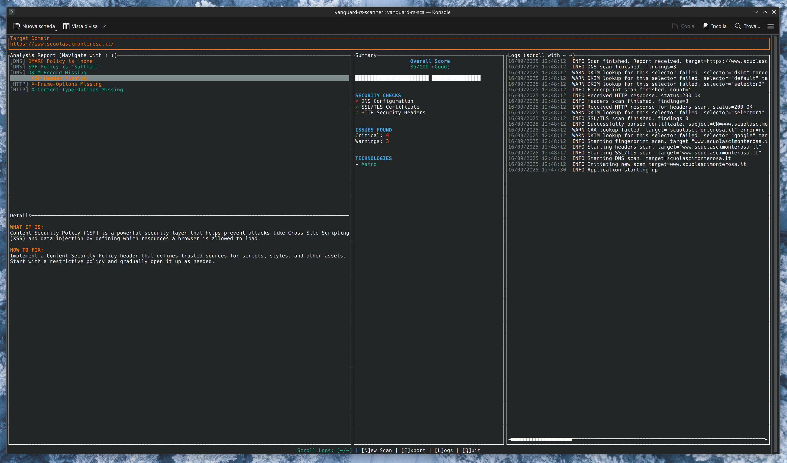

# Vanguard RS - The scanner


*A hyper-performant, privacy-first security analysis toolkit forged in 100% Rust, presented in a sleek and interactive TUI dashboard.*

[](https://opensource.org/licenses/MIT)
[](https://www.rust-lang.org/)
[]()

---

## ⚠️ Disclaimer

**Vanguard RS** is a powerful security analysis toolkit designed for educational purposes and for security professionals to assess assets they are explicitly authorized to test.

The unauthorized scanning of computer systems and networks is **illegal** and **unethical**. Laws regarding unauthorized scanning vary by jurisdiction, but it is widely considered a criminal offense. Users of this software are expected to act responsibly and in accordance with all applicable local, state, and federal laws.

By downloading, installing, or using Vanguard RS, you acknowledge and agree to the following terms:

1.  **Authorized Use Only:** You will only use this software to scan systems and networks that you own or for which you have obtained explicit, written permission from the owner.
2.  **Full Responsibility:** You are solely responsible for your actions. The author(s) and contributor(s) of this project assume **no liability** and are not responsible for any misuse, damage, or legal consequences caused by the use or misuse of this program.
3.  **No Warranty:** This software is provided "as is," without warranty of any kind, express or implied.

Use this tool to make the internet a safer place, not to cause harm. **Always act ethically.**

## The Mission

Vanguard RS aims to democratize cybersecurity. We believe that everyone, from students to seasoned professionals, should have access to high-quality tools to understand and improve their security posture without compromising on privacy. Vanguard RS is built on three pillars: **Local Power, Radical Transparency, and Total User Control.**

This is a tool built for the community, by the community. It performs all scans on your machine, ensuring that no sensitive data ever leaves your control.

## Key Features

-   **Interactive TUI Dashboard**: A powerful, keyboard-driven Terminal User Interface built with `ratatui`. It's not just a report; it's an interactive analysis station.
-   **At-a-Glance Summary**: An animated security score gauge and a clear summary panel give you an immediate understanding of the target's security posture.
-   **In-Depth Analysis View**: Don't just see problems—understand them. An interactive, tabbed view categorizes findings by severity (`Critical`, `Warning`, `Info`). Select any issue to get a detailed explanation of **what it is** and **how to fix it**, powered by a built-in knowledge base.
-   **Comprehensive Scanning**:
    -   **DNS**: Checks for critical anti-spoofing records like SPF and DMARC.
    -   **SSL/TLS**: Validates certificate chain, expiry, and configuration.
    -   **HTTP Headers**: Scans for crucial security headers like HSTS, CSP, and X-Frame-Options.
    -   **Technology Fingerprinting**: Intelligently identifies the underlying tech stack (web servers, CMS, frameworks, etc.) from multiple sources.
-   **Blazingly Fast & Concurrent**: Leverages Rust and `tokio` to run all scan modules in parallel. The total scan time is determined by the slowest check, not the sum of all checks.
-   **100% Privacy-First**: No data is sent to third-party servers. All checks, analysis, and reporting happen locally. Period.
-   **Responsible by Design**: A mandatory, clear legal disclaimer on startup ensures users understand their responsibilities.
-   **JSON Export**: Easily export the full, detailed scan report to a JSON file for archival, scripting, or integration with other tools.

## The Architectural Choice: Why 100% Rust?

This project began with a different stack (Tauri + SolidJS). It became clear that the project's core ethos—performance, security, and minimal overhead—demanded a pivot to a pure Rust architecture for several uncompromising reasons:

1.  **Zero-Overhead Philosophy**: By eliminating the webview and JS bridge, we achieved near-instantaneous startup and a minimal memory/CPU footprint. It's as close to the metal as it gets.

2.  **Fearless Concurrency as a First-Class Citizen**: Security scanning is an embarrassingly parallel problem. Rust and `tokio` allow us to execute tasks concurrently with compile-time guarantees against data races, making high performance a feature, not an afterthought.

3.  **Unmatched Reliability and Safety**: As a security tool, it must be secure itself. Rust's strict compiler eliminates entire classes of bugs, ensuring the logic we write is the logic that runs.

4.  **A Cohesive, Powerful TUI with `ratatui`**: A Terminal User Interface is the native habitat for our target audience. `ratatui` allows us to build a complex, interactive, and responsive dashboard that runs everywhere, including over SSH.

5.  **The Single Static Binary**: The result is a single, self-contained executable. No dependencies, no runtimes. Drop it on a server or laptop, and it just works. This is the ultimate form of portability.

## Tech Stack

-   **Core Language**: [Rust](https://www.rust-lang.org/) (2024 Edition)
-   **Terminal UI**: [Ratatui](https://ratatui.rs/)
-   **Terminal Backend**: [Crossterm](https://github.com/crossterm-rs/crossterm)
-   **Asynchronous Runtime**: [Tokio](https://tokio.rs/)
-   **Serialization**: [Serde](https://serde.rs/) / [Serde JSON](https://github.com/serde-rs/json)
-   **HTTP Client**: [Reqwest](https://github.com/seanmonstar/reqwest)
-   **DNS Resolution**: [Hickory DNS](https://github.com/hickory-dns/hickory-dns)
-   **HTML Parsing**: [Scraper](https://github.com/causal-agent/scraper)
-   **Certificate Parsing**: [x509-parser](https://github.com/rusticata/x509-parser)
-   **URL Parsing**: [url](https://crates.io/crates/url)
-   **Enum Utilities**: [Strum](https://crates.io/crates/strum)

## Getting Started

### Prerequisites

You need to have the Rust toolchain installed. You can get it from [rustup.rs](https://rustup.rs/).

### Installation & Usage

1.  Clone the repository:
    ```sh
    git clone https://github.com/your-username/vanguard-rs.git
    cd vanguard-rs
    ```

2.  Build the optimized release binary:
    ```sh
    cargo build --release
    ```

3.  Run the application:
    ```sh
    ./target/release/vanguard-rs
    ```

### Controls

-   **Disclaimer**: Press `Enter` to accept and continue.
-   **Global**:
    -   `q`: Quit the application at any time.
-   **Input Mode**:
    -   Type the target domain (e.g., `google.com`, `https://github.com/`).
    -   `Enter`: Start the scan.
-   **Analysis Mode**:
    -   `←` / `h` & `→` / `l`: Navigate between analysis tabs (`All`, `Critical`, etc.).
    -   `↑` / `k` & `↓` / `j`: Select an issue within the list.
    -   `n`: Start a new scan.
    -   `e`: Export the current report to a JSON file.

## Contributing

Contributions, issues, and feature requests are welcome! Feel free to check the [issues page](https://github.com/your-username/vanguard-rs/issues).

## License

This project is licensed under the MIT License.
